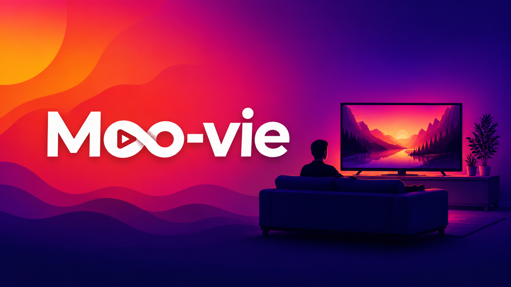
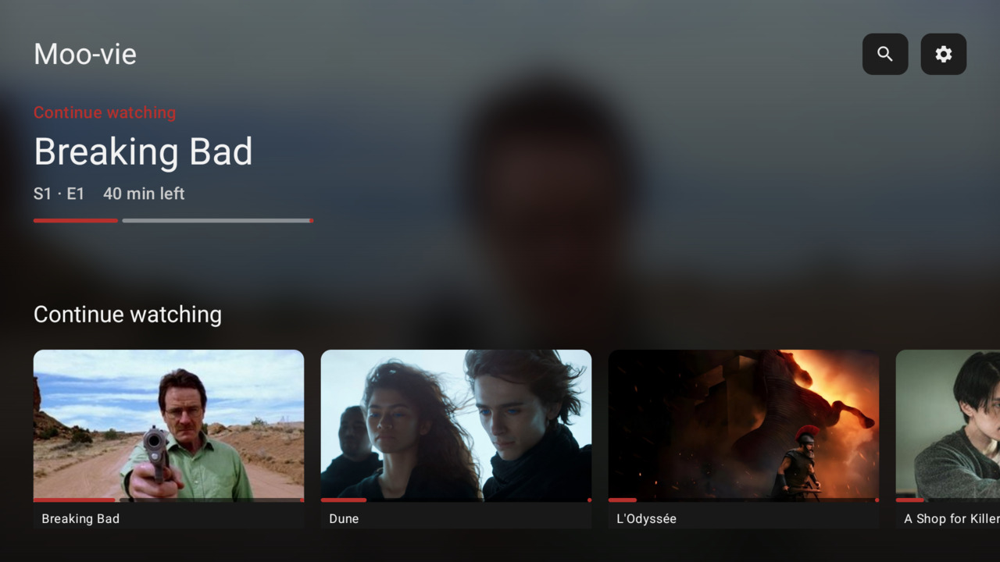
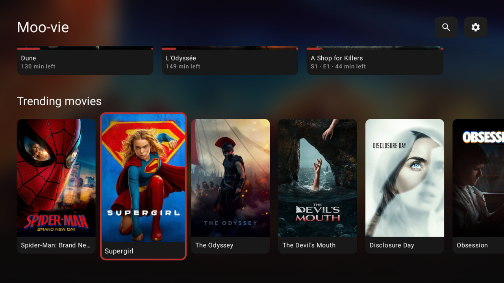
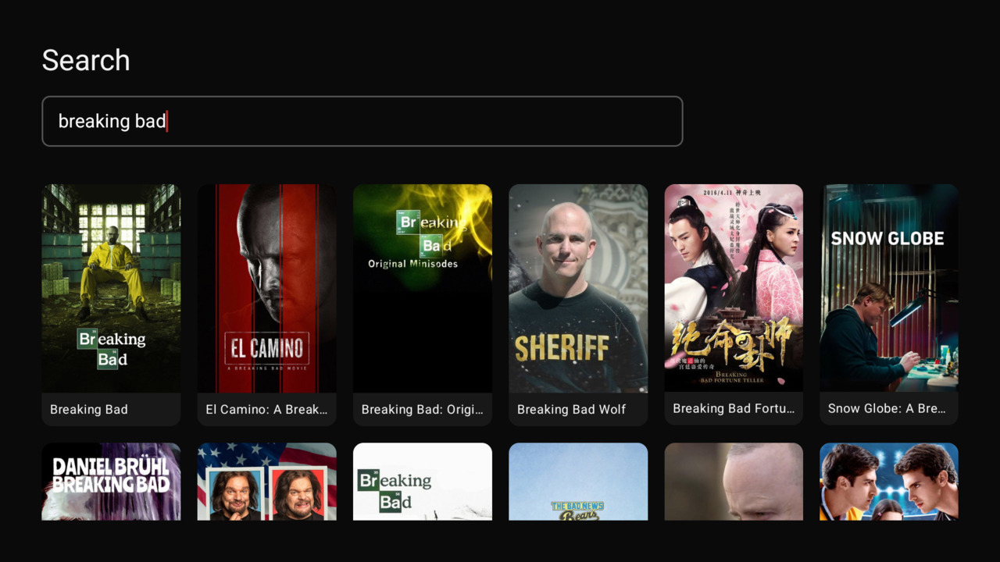
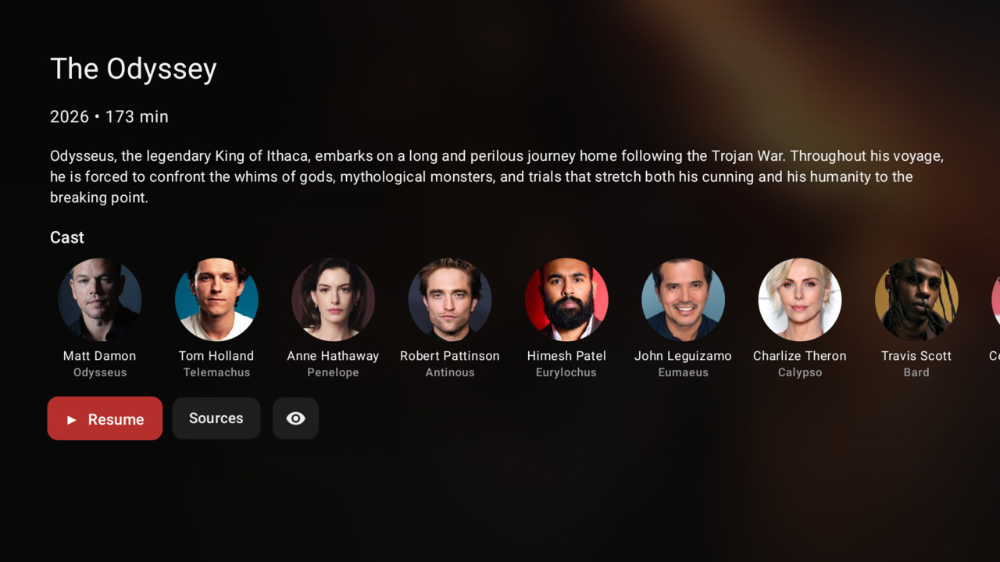
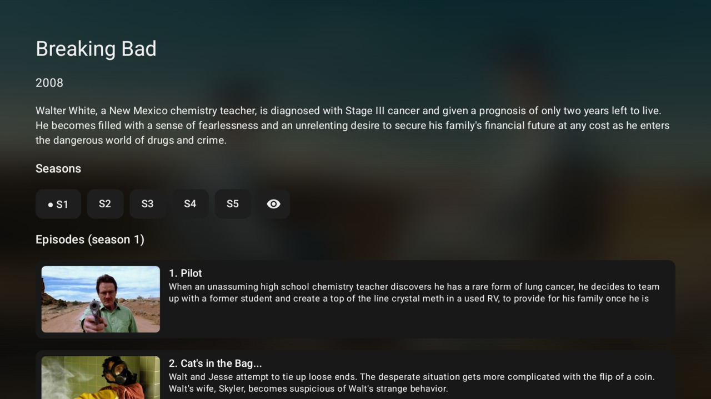
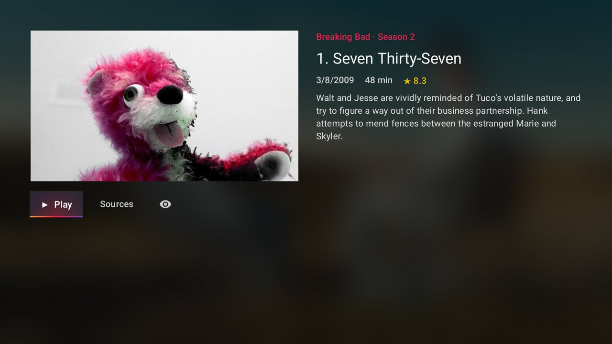
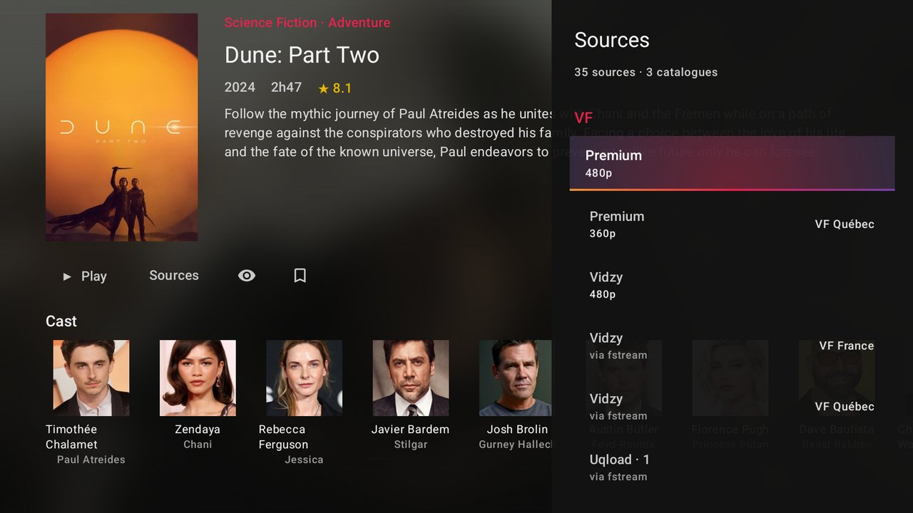
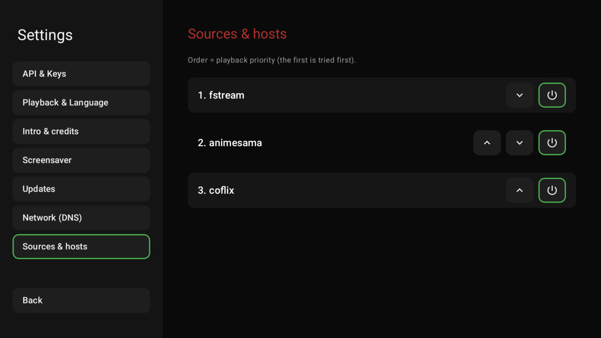
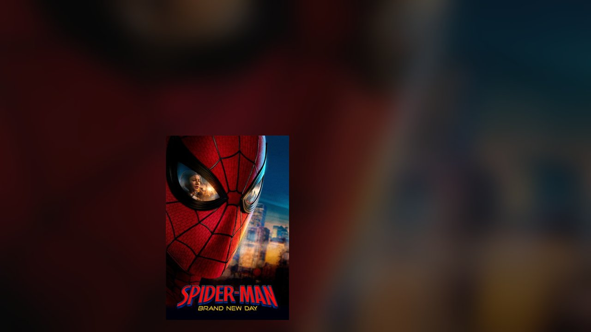

<p align="center">
  
</p>

# Moo-Vie

Application de streaming pour **Android TV** et **desktop** (Linux, Windows, macOS),
depuis une seule base de code Kotlin Multiplatform. L'extraction des sources se fait
**on-device** : pas de backend, pas de compte, pas de pub.

🇬🇧 [English version](README.md)

## Captures

| Accueil | Tendances |
|:---:|:---:|
|  |  |
| **Recherche** | **Fiche film** |
|  |  |
| **Fiche série** | **Fiche épisode** |
|  |  |
| **Panneau sources** | **Lecteur** |
|  |  |
| **Réglages** | **Écran de veille** |
|  |  |

> Captures prises en anglais ; l'interface est disponible en français, anglais et espagnol.

## Fonctionnalités

- **Accueil** — hero contextuel, rail *Reprendre la lecture* avec progression par épisode,
  rangées tendances et mieux notés (TMDB), badges vus.
- **Recherche** — résultats en grille, historique persistant, descente au D-pad du clavier
  vers les résultats.
- **Films & séries** — casting, saisons et épisodes avec vignettes, page de détail par
  épisode, marquage vu/non vu (épisode, saison entière ou film).
- **Lecture en un appui** — les sources chargent dès l'ouverture d'une fiche ; un seul
  bouton **Lire / Reprendre** joue la meilleure source dans ta langue (VF / VOSTFR / VO).
  Le panneau de sources reste là pour choisir un hébergeur à la main.
- **Lecteur** — reprise au timecode, choix des sous-titres et de la piste audio, vitesse de
  lecture, seek 15 s, mode scrub sur la barre de progression, touches média de la télécommande.
- **Passer intro & générique** (TheIntroDB) — passer le générique enchaîne l'épisode suivant.
- **Lecture auto de l'épisode suivant** — décompte de 10 s en fin d'épisode, annulable, qui
  bascule sur la saison suivante en fin de saison.
- **Écran de veille** — l'affiche rebondit à l'écran quand la lecture reste en pause.
- **Cache disque** — réponses TMDB et liens de sources résolus mis en cache.
- **Mises à jour intégrées** — vérification périodique des releases GitHub : bandeau sur
  l'accueil, pastille discrète pendant la lecture.

## Stack

| Couche | Techno |
|---|---|
| Langage / build | Kotlin 2.0, Kotlin Multiplatform (`androidMain` / `desktopMain` / `jvmCommon` partagé) |
| UI | Compose Multiplatform, design system partagé (`MoovieButton`, rails, dialogues) |
| Lecture | Media3 / ExoPlayer sur Android · libVLC (VLCJ) sur desktop |
| Réseau | Retrofit + OkHttp + kotlinx.serialization, DNS-over-HTTPS |
| Extraction | OkHttp + Jsoup + crypto Java (déobfuscation packer, AES) |
| Persistance | DataStore Preferences, cache disque OkHttp |
| Images | Coil 3 |
| CI | GitHub Actions : un tag `vX.Y.Z` produit l'APK signé, l'AppImage, le `.msi` et le `.dmg` |

## Installation

Récupérer le dernier build depuis les
[Releases](https://github.com/JibayMcs/MooVie/releases) :

- **Android TV** — sideload de `moovie-vX.Y.Z.apk`
- **Linux** — `moovie-vX.Y.Z-x86_64.AppImage` (`chmod +x` puis lancer — ni installation ni root)
- **Windows** — `moovie-vX.Y.Z.msi`
- **macOS** — `moovie-vX.Y.Z.dmg`

L'AppImage Linux embarque son runtime Java **et libVLC** : elle tourne sur
n'importe quelle distribution sans rien installer (vérifié sur Ubuntu 22.04/24.04,
Debian 12 et Arch). Elle se met aussi à jour depuis l'app. Sous **Windows et
macOS**, VLC doit toujours être installé sur la machine, et l'installeur renvoie
vers la page de release — un `.msi` exige les droits administrateur.

Au premier lancement, coller une [clé API TMDB](https://www.themoviedb.org/settings/api)
gratuite dans **Réglages → API & Clés**. Les mises à jour suivantes se font depuis l'app.

## Build

```bash
./gradlew assembleDebug              # APK debug Android
./gradlew assembleRelease            # APK signé (nécessite keystore.properties)
./gradlew :app:run                   # app desktop
./gradlew :app:packageDistributionForCurrentOS
```

Découpage : `app/src/commonMain` (ressources), `app/src/jvmCommon` (ViewModels, repositories,
UI partagée), `app/src/androidMain`, `app/src/desktopMain`. Un émulateur Android TV
préconfiguré et ses scripts de test sont dans `emulator/`.

## Licence

Open source, pour un usage personnel. Moo-vie n'héberge aucun contenu : elle ne fait que
résoudre des liens déjà publiquement accessibles.
