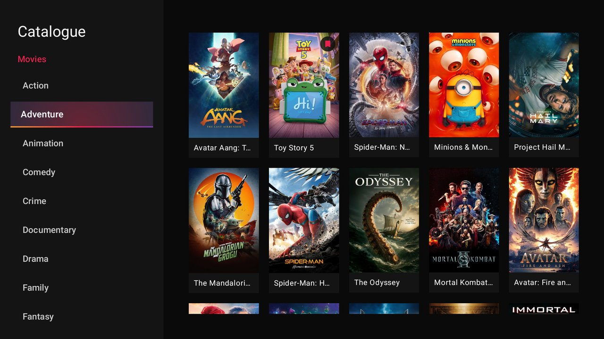
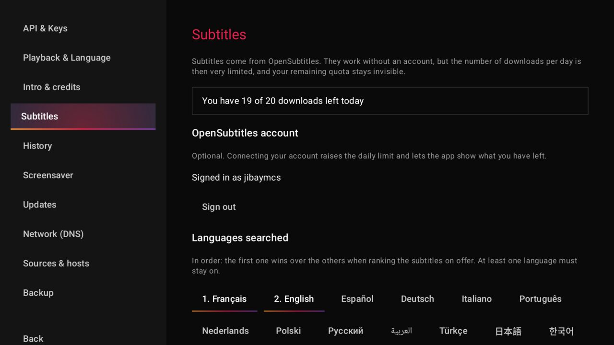

<p align="center">
  
</p>

# Moo-Vie

Streaming app for **Android TV**, **Android phone**, **desktop** (Linux, Windows, macOS)
and ~~iOS~~, built from a single Kotlin Multiplatform codebase. Source extraction runs
**on-device**: no backend, no account, no ads.

🇫🇷 [Version française](README.fr.md)

> [!IMPORTANT]
> Moo-vie is under active development. Things move between releases, and some rough
> edges are expected - [issues](https://github.com/JibayMcs/MooVie/issues) are welcome.

## Screenshots

| Home | Trending |
|:---:|:---:|
|  |  |
| **Search** | **Catalogue** |
|  |  |
| **Movie details** | **Show details** |
|  |  |
| **Episode details** | **Sources panel** |
|  |  |
| **Player** | **Settings** |
|  |  |
| **Subtitles** | **Screensaver** |
|  |  |

> UI available in French, English and Spanish.

## Features

- **Phones & tablets** - the same APK as the TV, laid out for a thumb: bottom
  navigation, portrait everywhere except the player, which turns by itself. Tap,
  double-tap and pinch drive playback; a long press opens the context menus the
  remote reaches by holding OK. Not a second codebase - one Kotlin Multiplatform
  source, TV or touch decided at runtime.
- **Profiles** - a name and a colour each, picked at launch. Progress, watched
  state, watchlist and the home layout are separate per profile; API keys, DNS
  and source order stay with the install. No password, no parental control: what
  they separate is progress, not access - on a shared TV the daily annoyance is
  finding somebody else's episode under *Continue watching*, not that others can
  see what you watch. The picker stays out of the way until a second profile
  exists.
- **Home, arranged by you** - rows are a layout you own, not a fixed list. Pin any
  catalogue genre (long-press on TV and phone, right-click on desktop) and choose
  where it lands; move, hide or remove any row, built-in ones included, from
  *Settings → Home*. A pinned row ends with a **See more** card that reopens its
  exact genre. Contextual hero, *Continue watching* with per-episode progress,
  trending and top-rated (TMDB), watched badges.
- **Search** - result grid, persistent history, D-pad flow from keyboard to results.
- **Movies & shows** - cast, seasons and episodes with stills, per-episode details page,
  watched/unwatched marking (episode, whole season or movie).
- **One-press playback** - sources load as soon as a title opens; a single
  **Play / Resume** picks the best source in your language (VF / VOSTFR / VO). A sources
  panel is there for manual host selection. Most catalogues are French-speaking, so
  **original-language playback has its own catalogue**, keyed on the TMDB id. Languages
  are never substituted for one another - VOSTFR carries burnt-in French subtitles you
  cannot turn off, so it is not a stand-in for VO.
- **Player** - resume at timecode, subtitle and audio track selection, playback speed,
  15 s seek, scrub mode on the progress bar, remote media keys.
- **Subtitles** (OpenSubtitles) - searched from the player, ranked by language, frame
  rate and release, and downloaded only on an explicit press since the daily allowance is
  small. Already-downloaded ones are marked so you never spend twice. Comes with an offset
  *and* a frame-rate correction: exact matching relies on hashing the video file, which
  segmented streams make impossible, so drift is the normal case rather than an accident.
- **Skip intro & credits** (TheIntroDB) - skipping credits rolls into the next episode.
  When a segment is missing, an icon in the control bar lets you **report it from the
  player**: mark the start, mark the end, confirm. Coverage is per episode, so the gaps
  are common and everyone's report fills them in. Needs a free TheIntroDB key.
- **Auto-play next episode** - 10 s countdown at the end of an episode, cancellable,
  rolling over to the next season.
- **Screensaver** - the poster bounces around the screen while playback stays paused.
- **Backup & restore** - export your progress, watchlist, history and settings to a USB
  stick - every profile, not just the one you are watching - and pick them up on another
  device. The import previews the file before acting
  (counts, export date, source device) and lets you **merge** - most recent progress wins,
  nothing is lost - or **replace**. A first-launch screen offers the restore instead of
  dropping you on an empty home. On Android, grant *All files access* when the screen
  asks: without it the file can only go in the app's own folder, which uninstalling
  erases - so a backup would survive a move to another device, but not a reinstall.
- **Sync across devices** - progress, watchlist and history follow you to every device,
  with no account and no server of ours. You supply the storage (Backblaze B2 today: a key
  to create and paste, like the TMDB one) and each device publishes **its own file** -
  nobody overwrites anybody. Merging keeps the most recent decision, deletions included:
  unmarking an episode here does not resurrect it there. The contents can be encrypted
  with a passphrase only you know; without it the host sees nothing but bytes. A wrong
  clock is not a problem - the drift against the server is measured and corrected.
- **Offline downloads** - keep a film or an episode on the device and watch it with no
  network, on TV, phone and desktop. From the sources panel with a long press, or straight
  from the player, where the button carries its own progress ring. The playlist and its
  segments are rewritten to local paths, so playback never calls the host back: a source
  link expires, what you downloaded does not.
- **Enter keys from your phone** (Android TV) - typing an API key on a remote, letter by
  letter on a grid keyboard, is the worst moment in the app. The TV shows a QR code, your
  phone opens a page served by the app itself over the local network, and you type on a
  touch keyboard: TMDB and TheIntroDB keys, OpenSubtitles account, sync credentials and
  passphrase. The server only lives while the code is on screen, its address carries a
  random token, and the page never shows an existing value back - only that it is set.
- **Offline-friendly** - TMDB responses and resolved source links are cached on disk.
- **In-app updates** - periodic check against GitHub Releases; a banner on the home
  screen, a discreet chip during playback.

## Roadmap

- **Cast to a TV (Google Cast)** - under study, for phone users who own no
  Android TV. Not a matter of dropping in the SDK: a Chromecast fetches the
  stream itself, and nearly every source only answers with a `Referer` and a
  `User-Agent` the receiver has no way to send. The workable shape is a small
  HTTP proxy on the phone that re-attaches them - which conveniently keeps
  DNS-over-HTTPS in the loop, where a Chromecast would use the router's resolver
  and hit the very blocking the app exists to route around. One question decides
  whether any of it stands, and it is untested, so there is no date on this.
- **No iOS support planned.** The constraints are heavy - sideloading, App Store
  policy, a separate player stack - and I have no Apple device to test on.
  Shipping something I cannot run myself would be worse than not shipping it.

## Stack

| Layer | Tech |
|---|---|
| Language / build | Kotlin 2.0, Kotlin Multiplatform (`androidMain` / `desktopMain` / shared `jvmCommon`) |
| UI | Compose Multiplatform, shared design system (`MoovieButton`, rails, dialogs) |
| Playback | Media3 / ExoPlayer on Android · libVLC (VLCJ) on desktop |
| Network | Retrofit + OkHttp + kotlinx.serialization, DNS-over-HTTPS |
| Extraction | OkHttp + Jsoup + Java crypto (packer deobfuscation, AES) |
| Storage | DataStore Preferences, OkHttp disk cache |
| Images | Coil 3 |
| CI | GitHub Actions: a `vX.Y.Z` tag builds the signed APK, AppImage, `.msi` and `.dmg` |

## Install

Grab the latest build from [Releases](https://github.com/JibayMcs/MooVie/releases):

- **Android TV and phone** - sideload `moovie-vX.Y.Z.apk` (one APK for both)
- **Linux** - `moovie-vX.Y.Z-x86_64.AppImage` (`chmod +x`, then run - no install, no root)
- **Windows** - `moovie-vX.Y.Z.msi`
- **macOS** - `moovie-vX.Y.Z.dmg`

The Linux AppImage bundles its own Java runtime **and libVLC**, so it runs on any
distribution with nothing to install (tested on Ubuntu 22.04/24.04, Debian 12 and
Arch), and updates itself from inside the app. On **Windows**, the `.msi` installs
per user - no admin rights - and adds Start-menu and desktop shortcuts; the in-app
banner then updates it in place. On **macOS**, the banner opens the release page
(the `.dmg` is installed by hand). Windows and macOS still need **VLC** installed
on the machine.

On first launch, paste a free [TMDB API key](https://www.themoviedb.org/settings/api)
under **Settings → API & Keys**. Later updates are handled from inside the app.

## Build

```bash
./gradlew assembleDebug              # Android debug APK
./gradlew assembleRelease            # signed APK (needs keystore.properties)
./gradlew :app:run                   # desktop app
./gradlew :app:packageDistributionForCurrentOS
```

Layout: `app/src/commonMain` (resources), `app/src/jvmCommon` (ViewModels, repositories,
shared UI), `app/src/androidMain`, `app/src/desktopMain`. A preconfigured Android TV
emulator and its test scripts live in `emulator/`.

**Subtitles work out of the box in the published builds** - the APK, AppImage, MSI and
DMG from [Releases](https://github.com/JibayMcs/MooVie/releases) all ship with what they
need. Nothing to create, nothing to paste. Optionally, connecting an OpenSubtitles
account in the settings raises the daily download limit and shows the quota left.

The rest of this paragraph only concerns people **building from source**. Subtitles rely
on an OpenSubtitles *consumer key*, which identifies the application; OpenSubtitles
mandates one key per app and bans accounts that ask their users to supply their own. That
key is injected at build time and is deliberately absent from this repository, so a build
from source simply turns subtitles off - everything else works. To enable them while
developing, create your own consumer on
[opensubtitles.com](https://www.opensubtitles.com/consumers) and drop the key in a
gitignored `opensubtitles.properties` at the root:

```properties
apiKey=YOUR_CONSUMER_KEY
```

`OPENSUBTITLES_API_KEY` in the environment works too, which is what CI uses.

## Contributing

**Contributions are open and wanted.** The desktop builds are the ones that need
eyes most: they are produced by CI for Linux, Windows and macOS, but each of those
lands on hardware, drivers and a libVLC install that nobody here can reproduce.
Testing one of them on your own machine is genuinely useful work.

If anything misbehaves - a build that won't start, a stream that plays on Android TV
but not on desktop, a control the remote can't reach - please
[open an issue](https://github.com/JibayMcs/MooVie/issues). What helps most:

- your platform and version (distribution, Windows/macOS build, TV box model)
- the app version, from **Settings → Updates**
- what you expected, and what happened instead
- for a playback problem: the title, and which source you picked in the panel

Pull requests are welcome too - a new source provider or host extractor is the most
valuable kind, since every dead link costs someone a title. `.claude/skills/add-source/`
documents how one is written and, more importantly, how to *measure* whether it earns
its place.

## Credits

Moo-vie stands on work done by others.

**Data & services**

- **[TMDB](https://www.themoviedb.org)** - every title, synopsis, poster, backdrop,
  cast and rating in the app comes from The Movie Database. It is what makes the
  catalogue a catalogue rather than a list of file names, and the app is useless
  without an API key of your own.
  *This product uses the TMDB API but is not endorsed or certified by TMDB.*
- **[TheIntroDB](https://theintrodb.org)** - community-sourced intro and credits
  timestamps, behind the *Skip intro* / *Skip credits* buttons and the roll into
  the next episode.
- **[Cloudflare](https://1.1.1.1) and [Quad9](https://quad9.net)** - the DNS-over-HTTPS
  resolvers you can pick from, which is what keeps source lookups working on
  networks where those domains are blocked at the DNS level.

**Open source**

- [Kotlin](https://kotlinlang.org), [Kotlin Multiplatform](https://kotlinlang.org/docs/multiplatform.html),
  [Compose Multiplatform](https://www.jetbrains.com/lp/compose-multiplatform/) and
  [kotlinx.serialization](https://github.com/Kotlin/kotlinx.serialization) - JetBrains
- [Media3 / ExoPlayer](https://developer.android.com/media/media3) and
  [DataStore](https://developer.android.com/topic/libraries/architecture/datastore) - Google / AndroidX
- [VLC / libVLC](https://www.videolan.org) - VideoLAN, via
  [vlcj](https://github.com/caprica/vlcj) by Caprica Software, which is what plays
  video on the desktop builds
- [OkHttp and Retrofit](https://square.github.io/okhttp/) - Square
- [jsoup](https://jsoup.org) - parses the pages sources are extracted from
- [Coil](https://coil-kt.github.io/coil/) - image loading and disk cache

## License

Open source, for personal use. Moo-vie hosts no content: it only resolves links that are
already publicly reachable.
